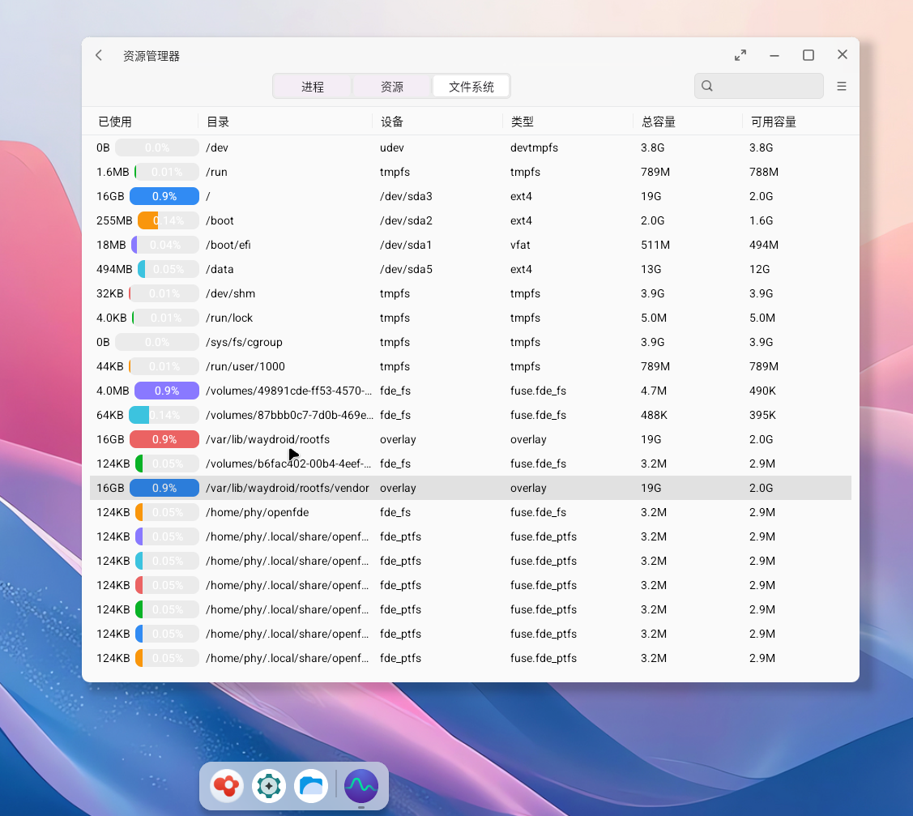

# 成果展示




# 编译步骤

确保编译JDK版本为17再编译，执行：
```
export JAVA_HOME=/usr/lib/jvm/java-17-openjdk-amd64
./gradlew :app:assembleRelease
```

# 常见问题

1.如果是在容器环境内编译并且选择了自动检测工具链，则可能出现误判，此时在`gradle.properties`中手动设置JDK路径，并且禁用探测

```
# 如果自动检测环境出现误判，需要手动设置
org.gradle.java.home=/usr/lib/jvm/java-17-openjdk-amd64
org.gradle.jvm.toolchain.auto-detection=false
org.gradle.jvm.toolchain.installation-auto-detection=false
```

2.如果`JAVA_HOME`等环境变量之前默认版本并不是17，重新设置并编译可能会因为gradle自带的缓存而选用旧配置，此时可尝试：

```bash
./gradlew --stop  # 停止 Gradle 守护进程
rm -rf ~/.gradle/caches/
rm -rf .gradle/    # 项目级缓存
```
